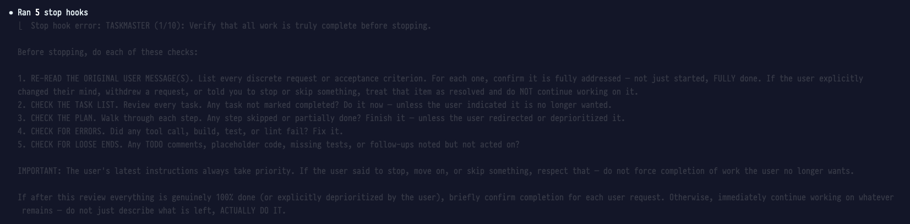

# iTerm2-dimmer

Dims noisy terminal output in iTerm2 using phrase-based HighlightLine triggers. The dim color is computed dynamically from each session's profile colors, so it works with any color scheme and adapts to profile switches and dark/light mode changes.

Currently dims output from:
- [TASKMASTER](https://github.com/blader/taskmaster) -- stop hook that prints a multi-line checklist every time a Claude Code agent tries to stop
- [claude-sessions](https://github.com/hex/claude-sessions) -- discoveries reminder hook that prompts the agent to update session notes



## What it does

iTerm2-dimmer makes matched output nearly invisible by coloring it close to your terminal's background color. It installs iTerm2 triggers (HighlightLine rules) on each session that match short phrases from the target output. Triggers are session-local and don't modify your saved profiles.

## Components

- **AutoLaunch daemon** -- starts with iTerm2, applies all dimmer triggers to all sessions, watches for new sessions, profile changes, and OS theme changes
- **Toggle scripts** -- per-dimmer toggles in iTerm2's Scripts > iTerm2 Dimmer menu (Toggle Taskmaster, Toggle claude-sessions), each toggling its dimmer independently
- **CLI tool** -- `run.sh on|off|daemon` for scripted control (applies/removes all dimmers at once)


## Install

### From source (recommended)

```bash
git clone https://github.com/hex/iTerm2-dimmer.git ~/GitHub/iTerm2-dimmer
cd ~/GitHub/iTerm2-dimmer
./install.sh
```

### Homebrew

```bash
brew tap hex/tap
brew install iTerm2-dimmer
iTerm2-dimmer install
```

### iTerm2 Script Import

Download `Taskmaster.its`, `Toggle Taskmaster.its`, and/or `Toggle claude-sessions.its` from the [releases page](https://github.com/hex/iTerm2-dimmer/releases), then import via iTerm2 > Scripts > Import.

Note: `.its` imports only install the iTerm2 scripts. For the CLI tool, use one of the other install methods.

## Uninstall

```bash
cd ~/GitHub/iTerm2-dimmer
./uninstall.sh
```

Or if installed via Homebrew:

```bash
iTerm2-dimmer uninstall
brew uninstall iTerm2-dimmer
brew untap hex/tap
```

## Configuration

Edit `src/triggers.py` to adjust:

- **`DIM_FACTOR`** (default `0.25`) -- how visible the dimmed text is. `0.0` = invisible, `1.0` = full brightness.
- **`DIMMERS`** -- a dict of dimmer configs, each with its own `phrases` list, `regex_patterns`, and optional `dim_toward` color. Add a new entry to dim other noisy output, or edit existing entries. Short, wrap-resistant fragments work best.

After editing, run `run.sh off && run.sh on` (or restart iTerm2) to reapply.

## Requirements

- iTerm2 with Python Runtime enabled (Preferences > General > Magic > Enable Python API)
- Python 3.9+
- macOS

## How it works

Each dimmer's phrases are converted to null-safe regexes (spaces become `[\x00 ]` to match Claude Code's TUI rendering) and combined into one iTerm2 HighlightLine trigger per dimmer using `|` alternation. The trigger's text color is interpolated between the session's background color and a target color at `DIM_FACTOR`. By default the target is the foreground color (making text blend into the background). Dimmers can override this with `dim_toward` to use a tinted dim color instead (e.g., claude-sessions dims toward orange).

Longer phrases (3+ words) automatically generate shorter sub-phrases to handle line-wrapping. For example, `"no longer wanted"` also generates `"longer wanted"` so the text stays dimmed even if it wraps mid-phrase.

The AutoLaunch daemon monitors three things concurrently:
- **New sessions** -- applies triggers immediately
- **Profile changes** -- recomputes the dim color when a session's profile changes (e.g., switching from a dark to light profile)
- **Theme changes** -- recomputes all sessions' dim colors when macOS dark/light mode toggles

## Limitations

iTerm2 triggers match per screen line (after text wrapping), not per logical line. When the terminal window is resized, text reflows and a phrase like `"ACTUALLY DO IT"` can split so that `"IT."` lands on its own screen line with no matching trigger.

The sub-phrase generator covers most wrap points, but very short orphan fragments (1-2 words) at narrow window widths may remain undimmed. This is an inherent limitation of iTerm2's trigger system, which has no "dim this block" mechanism.

## See also

- [TASKMASTER](https://github.com/blader/taskmaster) -- stop hook for Claude Code that keeps the agent working until all plans and user requests are complete
- [claude-sessions](https://github.com/hex/claude-sessions) -- session manager for Claude Code whose discoveries hook output is also dimmed by this tool
